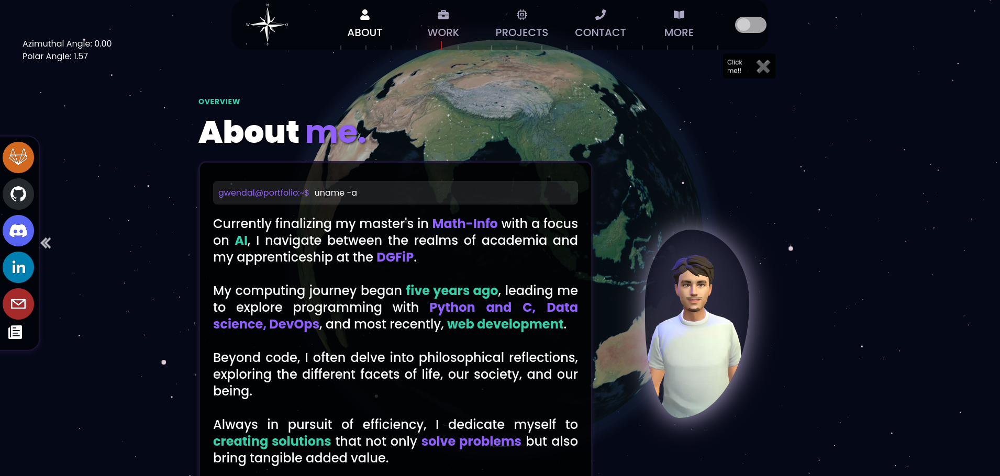
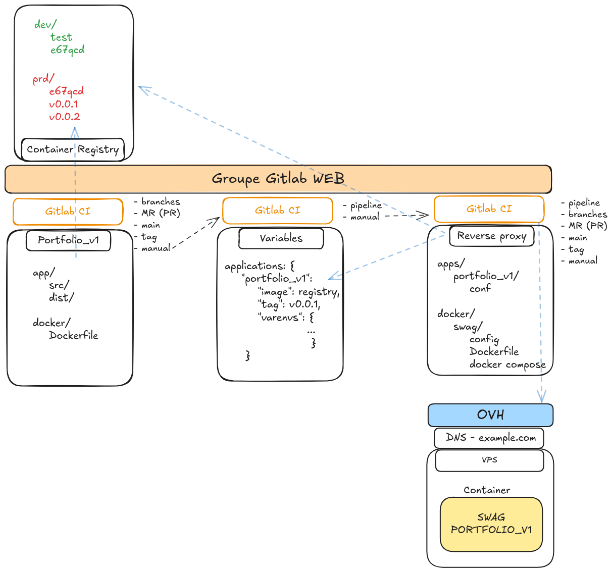
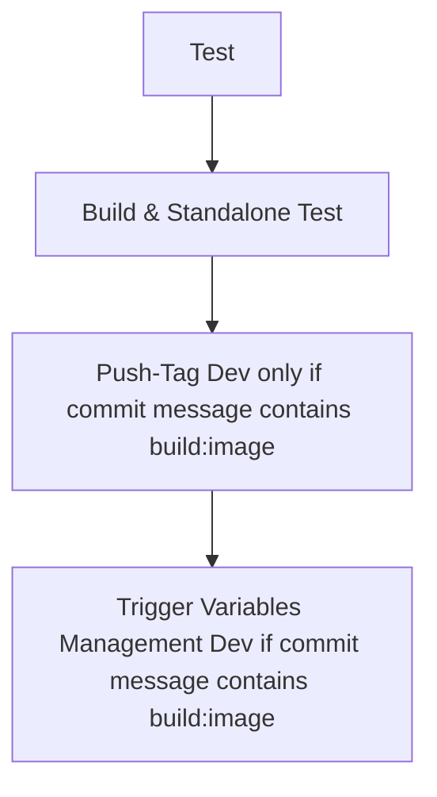
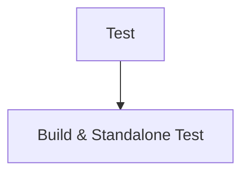
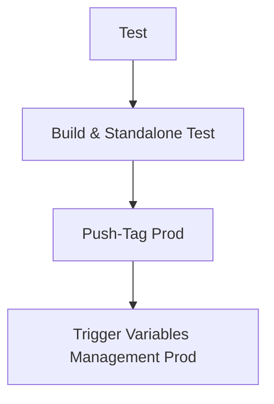

# Portfolio V1
***Gwendal Auphan***



## Description

This is the first portfolio I ever developed. Through this project, I discovered and learned how to use npm, React, Vite, and Tailwind. I also had to get familiar with 3D development in JavaScript. I tried my best to create a clean and well-structured project. However, I quickly realized that learning all these technologies at once wouldn’t be easy. That said, I pushed through, and I'm still proud of the result.

The biggest challenges were the initial design of the site—deciding on the layout and overall look, implementing smooth page transitions, integrating 3D elements in JavaScript, optimizing resource usage, and making the site responsive for mobile devices.

Finally, I set up a CI/CD pipeline to test, build, and deploy Docker images to GitLab's container registry. For deployment, I created a GitLab organization to manage multiple projects. As a result, I now have two additional repositories:

* [variables\_management](https://gitlab.com/web6464113/variables_management): This repository manages environment variables for the application deployment, such as the image name, tag, project name, and runtime environment variables.
* [reverse\_proxy\_web\_apps](https://gitlab.com/web6464113/reverse_proxy_web_apps): This repository exposes the application to the web using a reverse proxy that routes requests to the app. It retrieves the environment variables from the [variables\_management](https://gitlab.com/web6464113/variables_management) repository to perform the deployment.

**Initial Inspiration**
[3D Web Developer Portfolio](https://www.youtube.com/watch?v=0fYi8SGA20k&t=856s)


---

## Table of contents
- [Portfolio V1](#portfolio-v1)
  - [Description](#description)
  - [Table of contents](#table-of-contents)
  - [Architecture](#architecture)
- [Prerequisites](#prerequisites)
- [How to contribute](#how-to-contribute)
- [How to access to the app](#how-to-access-to-the-app)
  - [Check Health](#check-health)
- [How to deploy in production (CI/CD)](#how-to-deploy-in-production-cicd)
  - [Contribute](#contribute)
  - [Development Pipeline](#development-pipeline)
  - [Merge Request on GitLab UI](#merge-request-on-gitlab-ui)
  - [Create a Tag on GitLab UI](#create-a-tag-on-gitlab-ui)
  - [Trigger the Deploy Pipeline Manually](#trigger-the-deploy-pipeline-manually)
- [How to deploy in production manually (Not recommended)](#how-to-deploy-in-production-manually-not-recommended)
- [NPM Usage](#npm-usage)
- [Quality tools](#quality-tools)
  - [Implemented](#implemented)
  - [TODO](#todo)
- [References](#references)
- [Reminder](#reminder)
  - [to finish:](#to-finish)
  - [to check:](#to-check)

## Architecture

Voici le schéma de l'architecture générale:


---

# Prerequisites
**Get secrets**
```bash
export $(grep -v '^#' tooling.env | xargs)
./tooling/get_secrets.sh
```
and then enjoy !

# How to contribute

```bash
cd app
npm install
npm run dev
npm run build
```

# How to access to the app
**with npm -> http://localhost:5173/**
```bash
cd app
npm run dev
```
**with docker and nginx -> http://localhost/**
```bash
cd standalone
docker compose build
docker compose up -d
```
## Check Health

**Check the health of the app**
To check the health of the app, go to http://localhost/health.html

**Check the health of the app with curl**
To check the resolution of the name, curl --resolve gwendalauphan.com:80:127.0.0.1 http://gwendalauphan.com/health.html

---

# How to deploy in production (CI/CD)

## Contribute
```bash
git checkout main
git pull origin main
git checkout -b test-ci-cd
git add .
git commit -m "test de la CI/CD [build:image]" # if you want to push the image into dev registry
git push
```
## Development Pipeline
The development pipeline automates testing and building to ensure the application is ready for deployment. It triggers automatically on branch commits.

***Steps:***
1. **Test**: Run automated tests.
2. **Build & Standalone Test**: Build the application and test it in a standalone environment.
3. **Push-Tag Dev**: Push the tag to the development registry (if the commit message contains `build:image`).
4. **Trigger Variables Management Dev**: Update variables management for development (if the commit message contains `build:image`).



## Merge Request on GitLab UI
To integrate changes into the main branch, create a merge request in the GitLab UI. The pipeline runs automatically, allowing team members to review and approve changes.

***Steps:***
1. **Test**: Run automated tests.
2. **Build & Standalone Test**: Build the application and test it in a standalone environment.



## Create a Tag on GitLab UI
After merging, create a tag to register the application image and update variables management for production. Use the versioning format `vx.x.x`.

***Steps:***
1. **Test**: Run automated tests.
2. **Build & Standalone Test**: Build the application and test it in a standalone environment.
3. **Push-Tag Prod**: Push the tag to the production registry.
4. **Trigger Variables Management Prod**: Update variables management for production.



## Trigger the Deploy Pipeline Manually
To deploy manually, go to the GitLab UI and trigger the `trigger-variable-management-manual` step.

**Provide the following variables:**
- `REGISTRY_IMAGE`
- `PROJECT_NAME`
- `ENV_DEPLOYMENT`

---

# How to deploy in production manually (Not recommended)
```bash
cd docker
docker compose build
docker login registry.gitlab.com
docker push registry.gitlab.com/web6464113/portfolio_v1/portfolio_v1-app-builder:v0.0.1
```

Update the repo variables_management:
- https://gitlab.com/web6464113/variables_management

And trigger the pipeline **update_reverse_proxy** to deploy the project.

It will run another pipeline and playbooks to deploy the project in the folowing repo:
- https://gitlab.com/web6464113/reverse_proxy_web_apps

# NPM Usage

Look here for more information: [npm_usage](docs/npm_usage.md)

**1. Check dependencies**
```bash
npm install -g depcheck
depcheck
```

**2. Check Quality code**
```bash
npm install eslint --save-dev
npm install eslint-plugin-react --save-dev
npx eslint --init
npx eslint . --ext .js,.jsx
```

**3. Formatting**
```bash
npm install --save-dev prettier
npx prettier --write .
```

**Combine**
```bash
npm install --save-dev eslint-config-prettier
npm install --save-dev eslint-plugin-prettier
```

**4. Cleaner**
```bash
npm install --save-dev eslint-plugin-unused-imports
#modify .eslintrc.js
```
---

# Quality tools
## Implemented
- Gitlab CI/CD
- CHANGELOG.md

## TODO
- npm run lint
- npm run format
- npm run test
- hadolint

# References
- [References and useful links of the project](docs/refs.md)

# Reminder

## to finish:
- avoid red cross on the pipeline (on the check tests)
- page coming soon en mansory

## to check:
- https://docs.gitlab.com/ci/docker/docker_layer_caching/
- https://docs.docker.com/build/bake/reference/
- Dockle
- Hadolint


