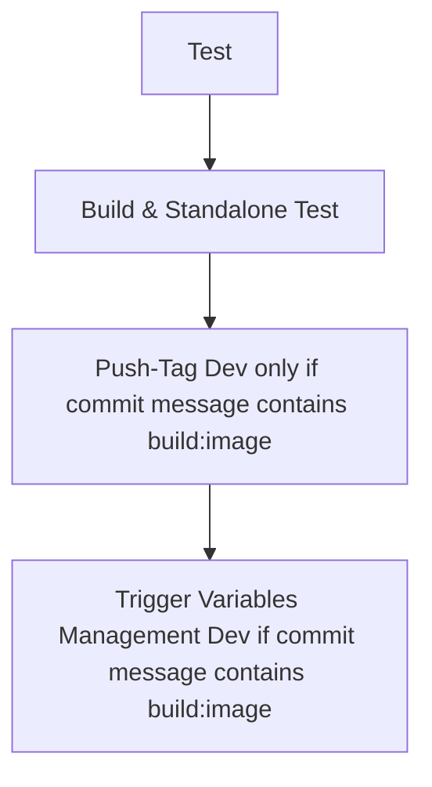
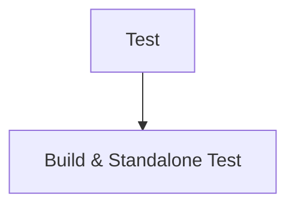
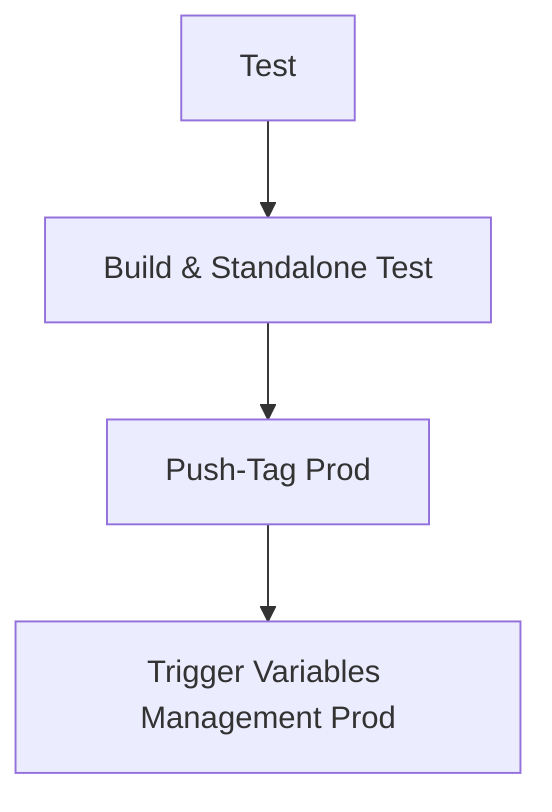

# Portfolio V1

## Description
This is the first version of my portfolio. It is a web application that showcases my work and projects. The application is built using React and Vite, and it is designed to be responsive and user-friendly.

This web application is including 3D js, a library I wanted to test and I hope you will like the result.

## Features
It implements a CI/CD pipeline using GitLab CI/CD, which automates the testing and deployment process. The application is containerized using Docker, and it can be deployed using Docker Compose.


# How to contribute

```bash
cd app
npm install
npm run dev
npm run build
```

# How to access to the app
## with npm -> http://localhost:5173/
```bash
cd app
npm run dev
```
## with docker and nginx -> http://localhost/
```bash
cd standalone
docker compose build
docker compose up -d
```

## Check the health of the app
To check the health of the app, go to http://localhost/health.html

## Check the health of the app with curl
To check the resolution of the name, curl --resolve gwendalauphan.com:80:127.0.0.1 http://gwendalauphan.com/health.html

# How to deploy in production (CI/CD)

## Development
```bash
git checkout main
git pull origin main
git checkout -b test-ci-cd
git add .
git commit -m "test de la CI/CD [build:image]" # if you want to push the image into dev registry
git push
```
## Development Pipeline
The development pipeline automates testing and building to ensure the application is ready for deployment. It triggers automatically on branch commits.

### Steps:
1. **Test**: Run automated tests.
2. **Build & Standalone Test**: Build the application and test it in a standalone environment.
3. **Push-Tag Dev**: Push the tag to the development registry (if the commit message contains `build:image`).
4. **Trigger Variables Management Dev**: Update variables management for development (if the commit message contains `build:image`).



## Merge Request on GitLab UI
To integrate changes into the main branch, create a merge request in the GitLab UI. The pipeline runs automatically, allowing team members to review and approve changes.

### Steps:
1. **Test**: Run automated tests.
2. **Build & Standalone Test**: Build the application and test it in a standalone environment.



## Create a Tag on GitLab UI
After merging, create a tag to register the application image and update variables management for production. Use the versioning format `vx.x.x`.

### Steps:
1. **Test**: Run automated tests.
2. **Build & Standalone Test**: Build the application and test it in a standalone environment.
3. **Push-Tag Prod**: Push the tag to the production registry.
4. **Trigger Variables Management Prod**: Update variables management for production.



## Trigger the Deploy Pipeline Manually
To deploy manually, go to the GitLab UI and trigger the `trigger-variable-management-manual` step.

### Provide the following variables:
- `REGISTRY_IMAGE`
- `PROJECT_NAME`
- `ENV_DEPLOYMENT`

---

## How to deploy in production manually (Not recommended)
```bash
cd docker
docker compose build
docker login registry.gitlab.com
docker push registry.gitlab.com/web6464113/portfolio_v1/portfolio_v1-app-builder:v0.0.1
```

Update the repo variables_management:
- https://gitlab.com/web6464113/variables_management

And trigger the pipeline **update_reverse_proxy** to deploy the project.

It will run another pipeline and playbooks to deploy the project in the folowing repo:
- https://gitlab.com/web6464113/reverse_proxy_web_apps


---

# Quality tools
## Implemented
- Gitlab CI/CD
- CHANGELOG.md

## TODO
- npm run lint
- npm run format
- npm run test
- hadolint


## Reminder

### to finish:
- avoid red cross on the pipeline (on the check tests)

### to check:
- https://docs.gitlab.com/ci/docker/docker_layer_caching/
- https://docs.docker.com/build/bake/reference/
- Dockle
- Hadolint


