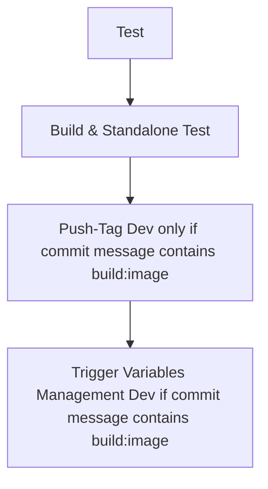
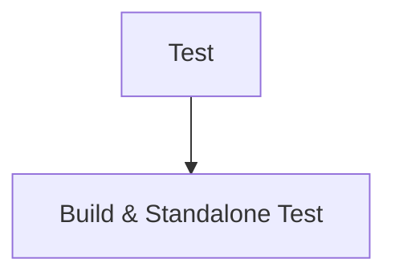
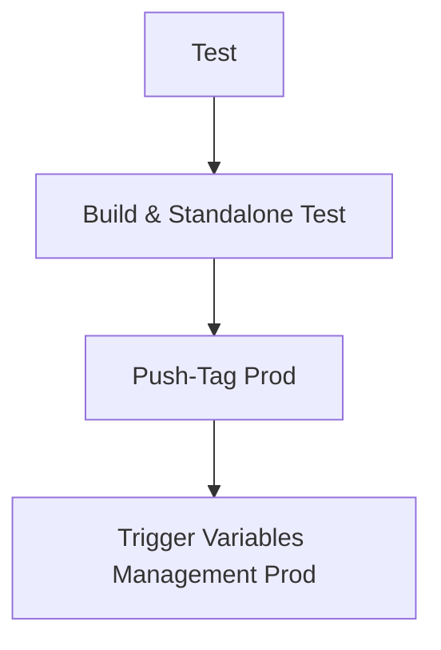

# Portfolio V1

## Description
This is a simple portfolio website built with HTML, CSS, and JavaScript. It showcases my projects and skills in a clean and modern design.

# How to contribute

```bash
cd app
npm install
npm run dev
```
# How to run standalone
```bash
cd standalone
docker compose up -d
```
Go to http://localhost
To check the health of the app, go to http://localhost/health.html
To check the resolution of the name, curl --resolve gwendalauphan.com:80:127.0.0.1 http://gwendalauphan.com/health.html

# How to deploy in production (CI/CD)

## Development
```bash
git checkout main
git pull origin main
git checkout -b test-ci-cd
git add .
git commit -m "test de la CI/CD [build:image]" # if you want to push the image into dev registry
git push
```

Development Pipeline


## Merge request on Gitlab UI
Go on Gitlab UI, and create a merge request into the branch main.
Let the pipeline running and people approve.
Merge request Pipeline


### Create a tag on Gitlab UI
Once you merged you need create a tag to register your application image and update variables_managment in production.
Create a tag following the regex: vx.x.x
Tag Pipeline


### Tigger manually the deploy pipeline
Go on Gitlab UI, and trigger the trigger-variable-manament-manual step.
Then input the following variables:
- REGISTRY_IMAGE
- PROJECT_NAME
- ENV_DEPLOYMENT


# How to deploy in production (Manually)
```bash
cd docker
docker compose build
docker push registry.gitlab.com/web6464113/portfolio_v1/portfolio_v1-app-builder:v0.0.1
```

Update the repo variables_management:
- https://gitlab.com/web6464113/variables_management


Then, goto the project:
- https://gitlab.com/web6464113/reverse_proxy_vm_2cpu

And build the project the image.
Run the pipeline or the playbooks to deploy the project.


Quality tools
- Gitlab CI/CD
- npm run lint
- npm run format
- npm run test
- hadolint
- CHANGELOG.md

Need to finish:
- tag-release, implement trigger to update variables_management for dev and prd

Need to check:
- https://docs.gitlab.com/ci/docker/docker_layer_caching/
- https://docs.docker.com/build/bake/reference/
- Dockle
- Hadolint


