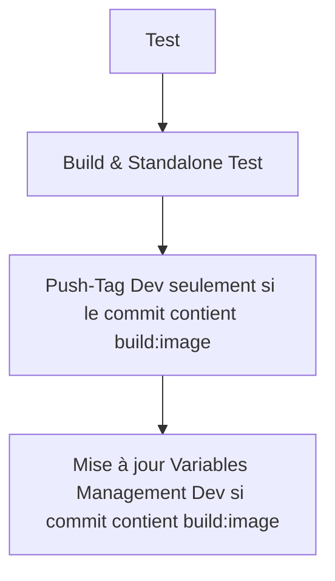
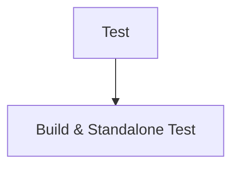
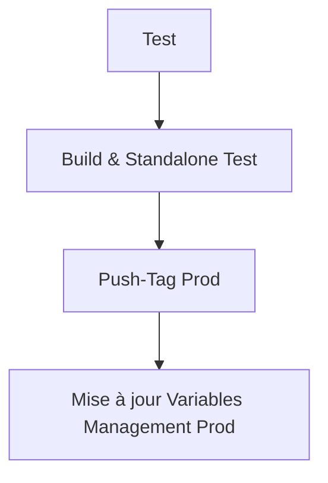

# Portfolio V1
***Gwendal Auphan***
### 👉 [🇬🇧 English version](README.md)


## Description

Ceci est le premier portfolio que j’ai développé. À travers ce projet, j’ai découvert et appris à utiliser npm, React, Vite et Tailwind. J’ai également dû me familiariser avec le développement 3D en JavaScript. J’ai fait de mon mieux pour créer un projet propre et bien structuré. Cependant, j’ai rapidement compris qu’apprendre toutes ces technologies en même temps ne serait pas facile. Cela dit, j’ai persévéré et je suis toujours fier du résultat.

Les plus grands défis ont été : concevoir le design initial du site — choisir la mise en page et l’apparence générale, implémenter des transitions de pages fluides, intégrer des éléments 3D en JavaScript, optimiser l’utilisation des ressources, et rendre le site responsive pour les appareils mobiles.

Enfin, j’ai mis en place un pipeline CI/CD pour tester, construire et déployer des images Docker dans le registre de conteneurs de GitLab. Pour le déploiement, j’ai créé une organisation GitLab pour gérer plusieurs projets. J’ai donc maintenant deux dépôts supplémentaires :

* [variables\_management](https://gitlab.com/web6464113/variables_management) : Ce dépôt gère les variables d’environnement pour le déploiement de l’application, comme le nom de l’image, le tag, le nom du projet et les variables d’environnement d’exécution.
* [reverse\_proxy\_web\_apps](https://gitlab.com/web6464113/reverse_proxy_web_apps) : Ce dépôt expose l’application au web en utilisant un reverse proxy qui route les requêtes vers l’app. Il récupère les variables d’environnement depuis le dépôt [variables\_management](https://gitlab.com/web6464113/variables_management) pour effectuer le déploiement.

**Inspiration initiale**
[3D Web Developer Portfolio](https://www.youtube.com/watch?v=0fYi8SGA20k&t=856s)

---

## Sommaire
- [Portfolio V1](#portfolio-v1)
    - [👉 🇬🇧 English version](#--english-version)
  - [Description](#description)
  - [Sommaire](#sommaire)
  - [Architecture](#architecture)
- [Prérequis](#prérequis)
- [Comment contribuer](#comment-contribuer)
- [Comment accéder à l’application](#comment-accéder-à-lapplication)
  - [Vérifier la santé](#vérifier-la-santé)
- [Comment déployer en production (CI/CD)](#comment-déployer-en-production-cicd)
  - [Contribuer](#contribuer)
  - [Pipeline de développement](#pipeline-de-développement)
  - [Merge Request via GitLab UI](#merge-request-via-gitlab-ui)
  - [Créer un tag via GitLab UI](#créer-un-tag-via-gitlab-ui)
  - [Déclencher manuellement le pipeline de déploiement](#déclencher-manuellement-le-pipeline-de-déploiement)
- [Comment déployer en production manuellement (Non recommandé)](#comment-déployer-en-production-manuellement-non-recommandé)
- [Utilisation de NPM](#utilisation-de-npm)
- [Outils qualité](#outils-qualité)
  - [Implémenté](#implémenté)
  - [TODO](#todo)
- [Références](#références)
- [Rappel](#rappel)
  - [à finir :](#à-finir-)
  - [à vérifier :](#à-vérifier-)
- [Dépôt](#dépôt)

## Architecture

Voici le schéma de l’architecture générale :


---

# Prérequis
**Récupérer les secrets**
```bash
export $(grep -v '^#' tooling.env | xargs)
./tooling/get_secrets.sh
```

et profitez-en !

# Comment contribuer

```bash
cd app
npm install
npm run dev
npm run build
```

# Comment accéder à l’application

**avec npm -> [http://localhost:5173/](http://localhost:5173/)**

```bash
cd app
npm run dev
```

**avec docker et nginx -> [http://localhost/](http://localhost/)**

```bash
cd standalone
docker compose build
docker compose up -d
```

## Vérifier la santé

**Vérifier la santé de l’application**
Pour vérifier la santé de l’app, allez sur [http://localhost/health.html](http://localhost/health.html)

**Vérifier la santé avec curl**
Pour vérifier la résolution du nom,

```bash
curl --resolve gwendalauphan.com:80:127.0.0.1 http://gwendalauphan.com/health.html
```

---

# Comment déployer en production (CI/CD)

## Contribuer

```bash
git checkout main
git pull origin main
git checkout -b test-ci-cd
git add .
git commit -m "test de la CI/CD [build:image]" # si vous souhaitez pousser l’image dans le registre dev
git push
```

## Pipeline de développement

Le pipeline de développement automatise les tests et la construction pour garantir que l’application est prête au déploiement. Il se déclenche automatiquement sur les commits de branche.

***Étapes :***

1. **Test** : Exécuter les tests automatisés.
2. **Build & Standalone Test** : Construire l’application et la tester dans un environnement autonome.
3. **Push-Tag Dev** : Pousser le tag vers le registre de développement (si le message du commit contient `build:image`).
4. **Trigger Variables Management Dev** : Mettre à jour le gestionnaire de variables pour le développement (si le message du commit contient `build:image`).



## Merge Request via GitLab UI

Pour intégrer des changements dans la branche main, créez une merge request dans l’interface GitLab. Le pipeline s’exécute automatiquement et permet aux membres de l’équipe de relire et approuver les modifications.

***Étapes :***

1. **Test** : Exécuter les tests automatisés.
2. **Build & Standalone Test** : Construire l’application et la tester dans un environnement autonome.



## Créer un tag via GitLab UI

Après le merge, créez un tag pour enregistrer l’image de l’application et mettre à jour le gestionnaire de variables pour la production. Utilisez le format de version `vx.x.x`.

***Étapes :***

1. **Test** : Exécuter les tests automatisés.
2. **Build & Standalone Test** : Construire l’application et la tester dans un environnement autonome.
3. **Push-Tag Prod** : Pousser le tag vers le registre de production.
4. **Trigger Variables Management Prod** : Mettre à jour le gestionnaire de variables pour la production.



## Déclencher manuellement le pipeline de déploiement

Pour déployer manuellement, allez dans l’interface GitLab et déclenchez l’étape `trigger-variable-management-manual`.

**Fournir les variables suivantes :**

* `REGISTRY_IMAGE`
* `PROJECT_NAME`
* `ENV_DEPLOYMENT`

---

# Comment déployer en production manuellement (Non recommandé)

```bash
cd docker
docker compose build
docker login registry.gitlab.com
docker push registry.gitlab.com/web6464113/portfolio_v1/portfolio_v1-app-builder:v0.0.1
```

Mettez à jour le dépôt variables\_management :

* [https://gitlab.com/web6464113/variables\_management](https://gitlab.com/web6464113/variables_management)

Et déclenchez le pipeline **update\_reverse\_proxy** pour déployer le projet.

Cela lancera un autre pipeline et des playbooks pour déployer le projet dans le dépôt suivant :

* [https://gitlab.com/web6464113/reverse\_proxy\_web\_apps](https://gitlab.com/web6464113/reverse_proxy_web_apps)

# Utilisation de NPM

Voir ici pour plus d’infos : [npm\_usage](docs/npm_usage.md)

**1. Vérifier les dépendances**

```bash
npm install -g depcheck
depcheck
```

**2. Vérifier la qualité du code**

```bash
npm install eslint --save-dev
npm install eslint-plugin-react --save-dev
npx eslint --init
npx eslint . --ext .js,.jsx
```

**3. Formatage**

```bash
npm install --save-dev prettier
npx prettier --write .
```

**Combiner**

```bash
npm install --save-dev eslint-config-prettier
npm install --save-dev eslint-plugin-prettier
```

**4. Nettoyeur**

```bash
npm install --save-dev eslint-plugin-unused-imports
# modifier .eslintrc.js
```

---

# Outils qualité

## Implémenté

* GitLab CI/CD
* CHANGELOG.md

## TODO

* npm run lint
* npm run format
* npm run test
* hadolint

# Références

* [Références et liens utiles du projet](docs/refs.md)

# Rappel

## à finir :

* éviter les croix rouges sur le pipeline (sur les tests check)
* page coming soon en masonry

## à vérifier :

* [https://docs.gitlab.com/ci/docker/docker\_layer\_caching/](https://docs.gitlab.com/ci/docker/docker_layer_caching/)
* [https://docs.docker.com/build/bake/reference/](https://docs.docker.com/build/bake/reference/)
* Dockle
* Hadolint

# Dépôt
base: https://gitlab.com/web6464113/portfolio_v1
